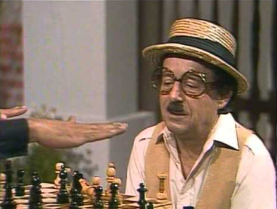

# Chess-py-rito
Very basic python chess game. The name is in honor of Roberto Gómez Bolaños, more commonly known by his stage name Chespirito.



### Install requirements

```shell script
pip install -r requirements.txt
```

###To start the game:

```shell script
python main.py
```